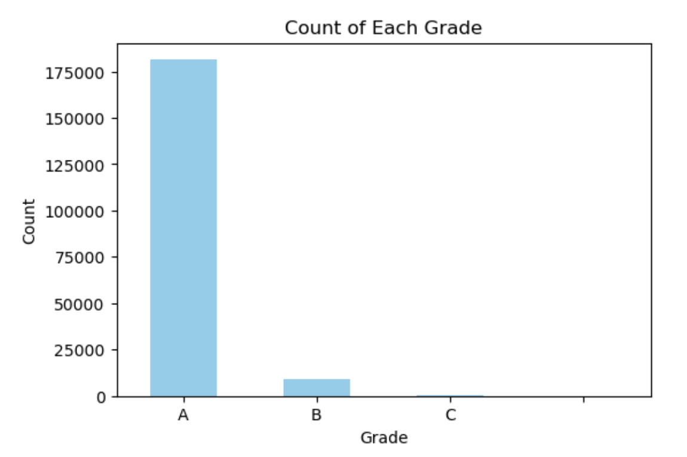
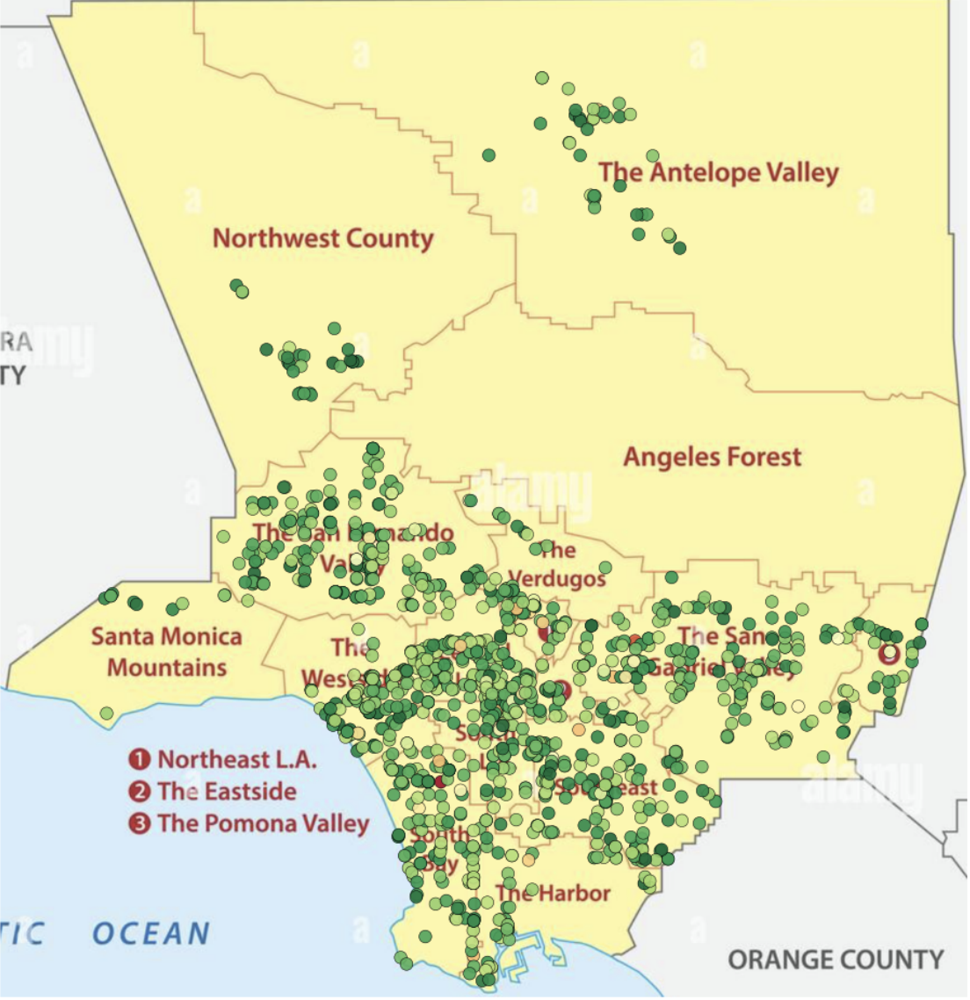
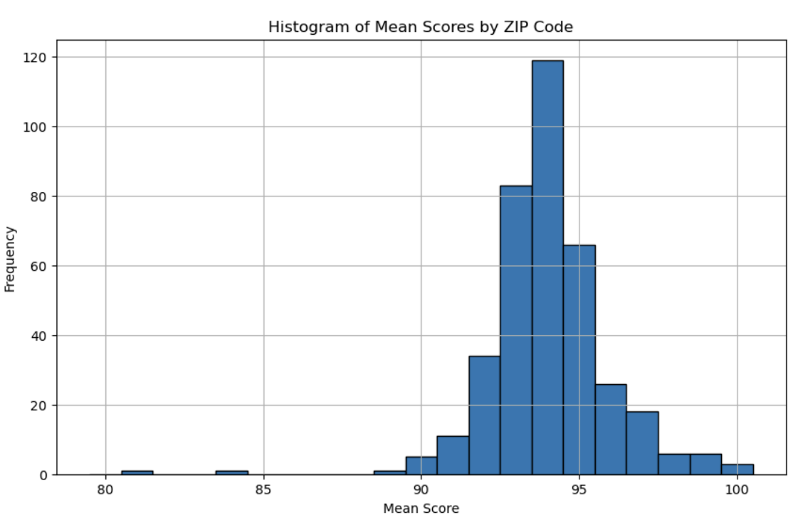
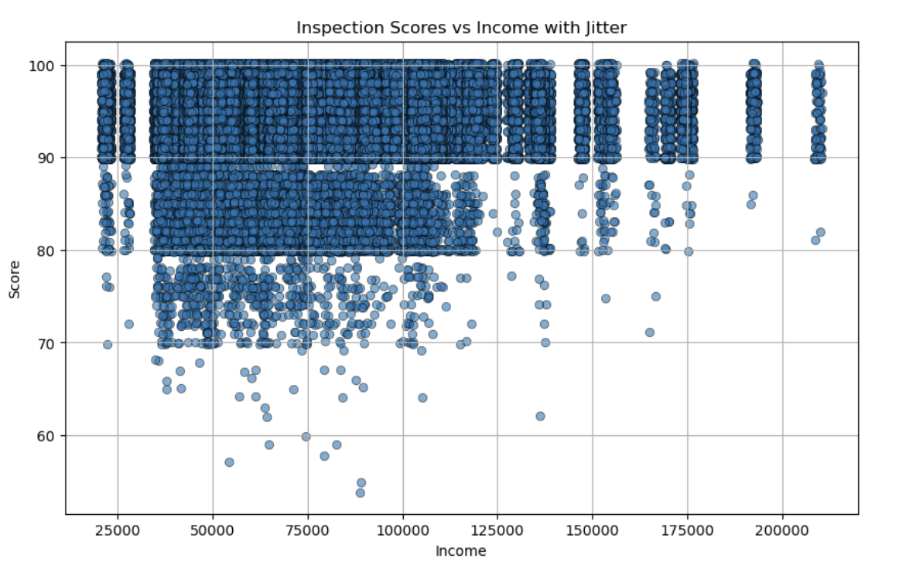
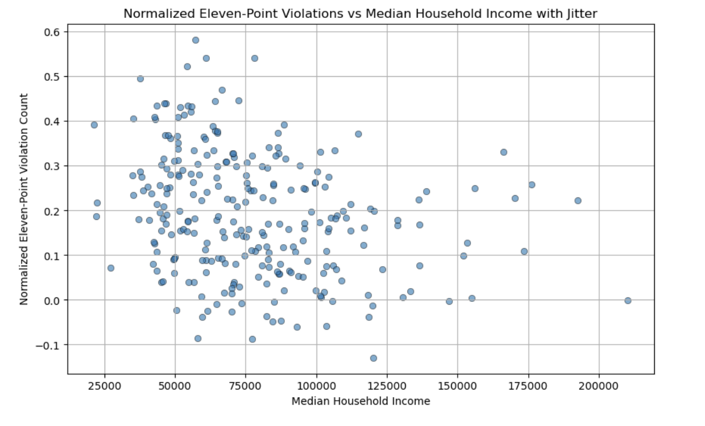

# LA County Health Inspection Analysis

Los Angeles County, California, is the largest U.S. county by population, home to approximately 10 million people from diverse ethnic and socioeconomic backgrounds. This diverse population contributes to a vibrant food culture, represented by tens of thousands of restaurants. This project analyzes LA County health inspection data from 2015 to 2017 to assess the overall safety of restaurants in the area and to determine whether different segments of the population face greater health and safety risks.

## Project Objectives

- **Geographic Analysis**: Identify if certain areas within LA County have better or worse food safety.
- **Socioeconomic Impact**: Determine if lower-income areas are disadvantaged in terms of food safety.
- **Public Health Insight**: Provide useful information to the LA County Department of Public Health for resource allocation and to help residents understand food safety risks.

⚠️ **File Size Notice**: The main Jupyter Notebook (`HealthInspectionAnalysis.ipynb`) and accompanying HTML files are too large to be rendered directly on GitHub. For a summarized version see below, or refer to the following PDF version of the notebook.

👉 [View the PDF version of the project](https://github.com/jrkruser/health_inspections/blob/main/Health_Inspections_Analysis.pdf) - Some graphics limited in PDF version

## Data Overview

The dataset consists of approximately 200,000 health inspections conducted between July 2015 and December 2017. The inspections dataframe includes 191,371 inspections, while the violations dataframe holds 906,014 health code violations from those inspections.

### Scoring System

- Inspections start with a score of 100 points.
- Violations result in deductions from this score.
- Grades:
  - **A**: 90-100
  - **B**: 80-89
  - **C**: 70-79
- Scores below 70 or multiple major violations may result in immediate reinspection or closure.

## Key Findings

### 1. Score Distribution
Scores below an 'A' grade are uncommon, with even lower scores being exceedingly rare.

### 2. Geographic Analysis
Using geographic coordinates for approximately 1,500 randomly selected inspections, we visualized the distribution of health scores across LA County.

*Figure 1: Health inspection scores across LA County.*

### 3. Analysis by Zip Code
- Inspections took place across 380 zip codes.
- Two zip codes (91749 and 90052) with low average scores were found to have very few inspections, indicating limited data.

### 4. Socioeconomic Correlation
- A weak positive relationship exists between median household income and inspection scores, but the impact is minimal (R-squared = 0.006).

*Figure 2: Relationship between median household income and inspection scores.*

### 5. Major Violations
- The most common major violation is the presence of insects, rodents, or birds in the restaurant.

*Figure 3: Relationship between income and major violations.*

- There is a weak negative correlation between median household income and the rate of major violations per zip code.

## Discussion

Overall, the analysis indicates that health inspection scores are relatively high across all geographic and socioeconomic segments of LA County. While lower-income areas showed slightly higher rates of major violations, these rates were still relatively low overall.

### Recommendations
1. **Targeted Interventions**: Focus on high-risk areas identified through geographic and socioeconomic analysis.
2. **Further Research**: Expand the study to include other types of food establishments and compare with data from other counties.

## Repository Contents

- `HealthInspectionAnalysis.ipynb`: The complete analysis notebook (not viewable on GitHub due to size).
- `Health_Inspections_Analysis.pdf`: A simplified version of the report for easy viewing.
- `images_graphics/`: Contains visualizations and graphics for this readme file along with graphics that accompany the notebook.

## How to Access the Full Analysis

Due to file size limitations, the full analysis cannot be rendered on GitHub. To view the complete project, download the repository and open the notebook locally using Jupyter Notebook.

